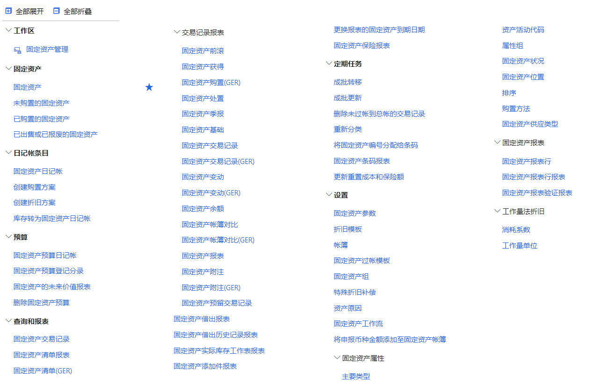
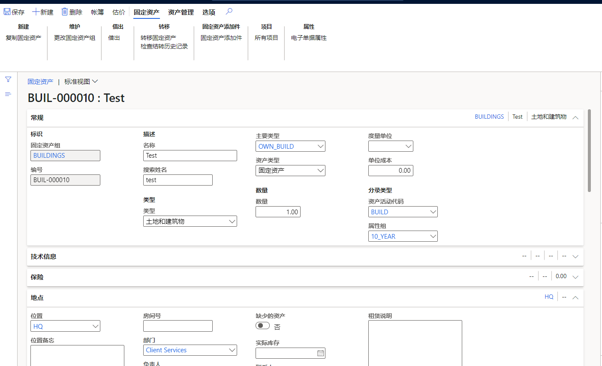

# D365 FA

## 1  Fix asset life-cycle management

## 1.1 D365 FI

演示地址： [固定资产管理 -- Finance and Operations (dynamics.com)](https://trial-cjfcc4.trial.operations.dynamics.com/?mode=trial&cmp=usmf&mi=AssetWorkspace)

功能模块：

## 1.2 D365 FA Life Cycle

资产录入：

## 1.3 D365 FA 业务流

.gif)

## 2 D365 FA & Power APP

The Dynamics 365 is a Premium connector in PowerApps, you must own PowerApps Plan 1 license at least to access the canvas app including Dynamics 365 data source.

## 3 Issues

