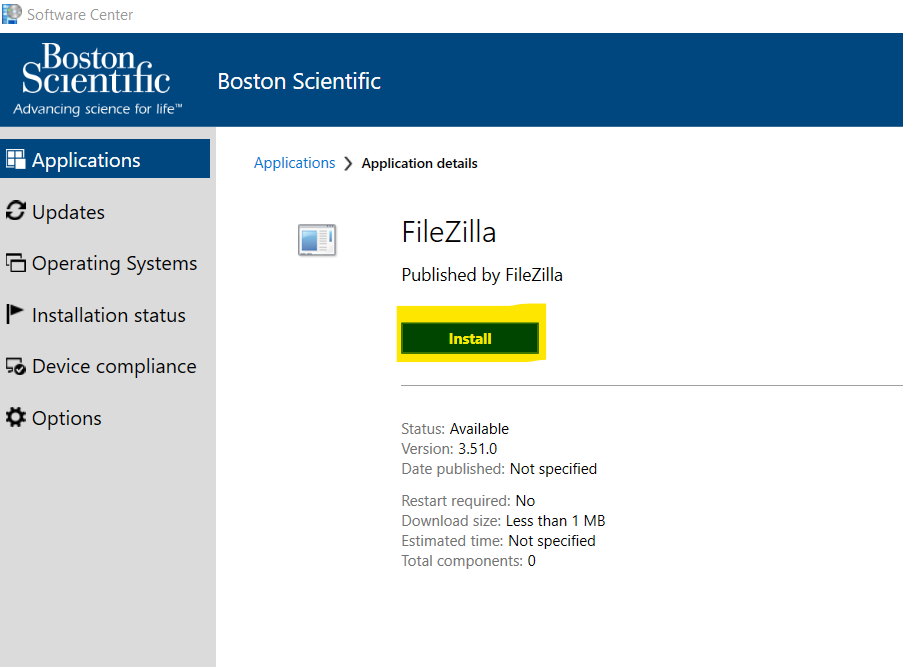
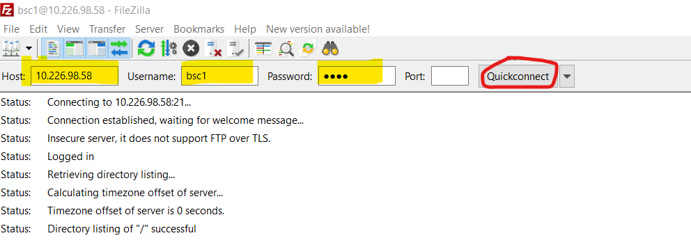
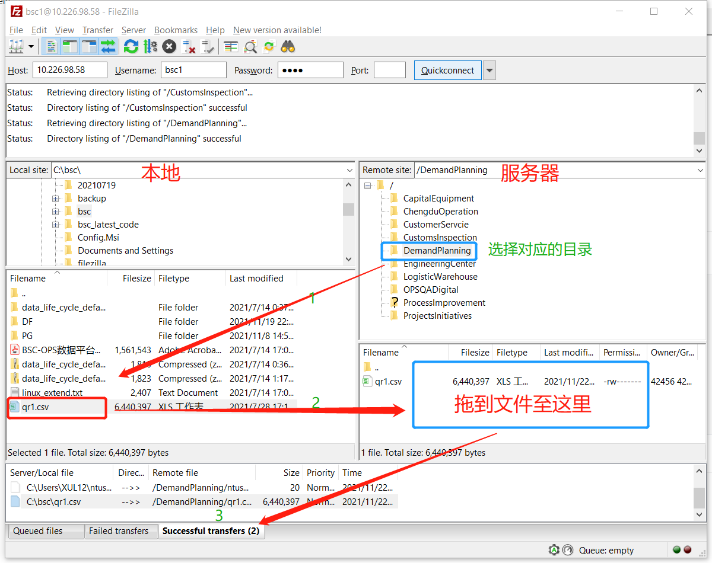
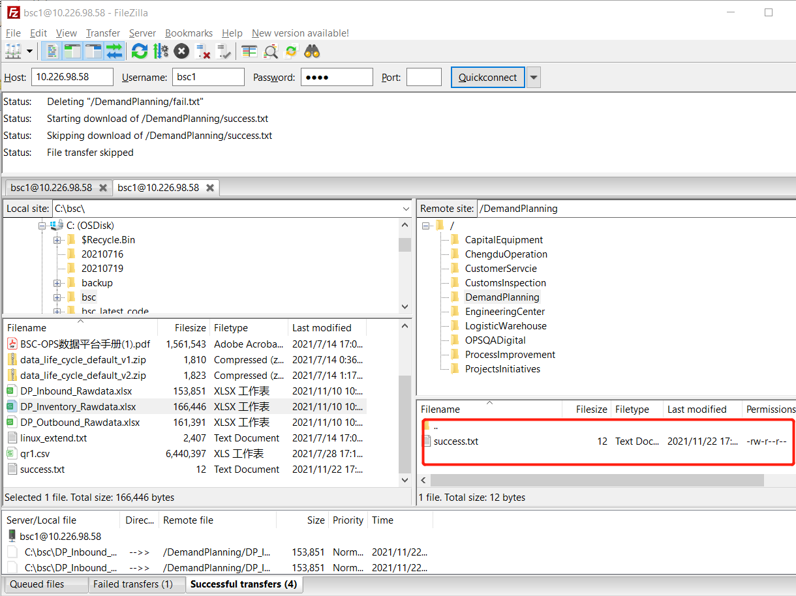

[TOC]


# FTP 服务用户手册

## 1 FileZilla 的配置与安装

FileZilla 客户端是一个快速可靠的、跨平台的FTP,FTPS和SFTP客户端。具有图形用户界面(GUI)和很多有用的特性



## 2 上传文件

### 2.1 连接配置

| Host     | 10.226.98.58 | FTP服务器 |
| -------- | ------------ | --------- |
| UserName | bsc1         | 虚拟账号  |
| Password | 1qaz         | 虚拟密码  |

虚拟账号列表：

| UserName | Password |
| -------- | -------- |
| bsc1     | 1qaz     |
| bsc2     | 2wsx     |
| bsc3     | 3edc     |
| bsc4     | 4rfv     |
| bsc5     | 5tgb     |



### 2.2 点击 Quickconnet

连接成功后日志如下：

```
Status:	Connecting to 10.226.98.58:21...
Status:	Connection established, waiting for welcome message...
Status:	Insecure server, it does not support FTP over TLS.
Status:	Logged in
Status:	Retrieving directory listing...
Status:	Calculating timezone offset of server...
Status:	Timezone offset of server is 0 seconds.
Status:	Directory listing of "/" successful
Status:	Connection closed by server
```

### 2.3 文件上传

- 选择服务器端对应的文件夹
- 拖到本地文件（目前支持**Excel格式**：*.XLSX)至服务端窗口
- 检查上传的状态




## 3 文件解析业务流程

### Step 1:  约定上传文件的数据结构

**约定内容包括**：

- 文件名：全英文，无空格符合，无特殊符号
- 文件类型：*.XLSX
- 文件结构（数据列）: 固定数据列顺序与类型
- 文件上传路径：固定上传路径

### Step 2: 设计与实现事实表

DW设计与实现各层对应的存储表根据约定的数据结构

如：ods_tb_inbound_fact

### Step 3: 实现各层之间的同步脚本

```xml
Local -> HDFS -> ODS -> DWD -> DWS -> DWT -> ADS -> PostgreSQL
```

### Step 4: 配置文件解析脚本

### Step 5:  配置文件解析频率

采用了Linux的crontab定时任务器

### Step 6: 文件上传后解析状态

系统自己解析文件，如果成功了，删除对应文件，设置一个成功日志。




**解析成功后的文件 under /root/bscflow/data/ftp**

```sh
[root@hadoop-master ftp]# ll
total 320
-rw-r--r--. 1 1630352 10000 160735 Nov 22 17:14 DP_Inbound_Rawdata.xlsx13.csv
-rw-r--r--. 1 root    root  160735 Nov 22 17:28 DP_Inbound_Rawdata.xlsx67.csv
[root@hadoop-master ftp]#
```


## 4 定时调度

频率：2分钟一次

方案：采用了Linux的crontab定时任务器

```sh
#crontab

crontab -l       #查看现有的所有 crontab 任务
crontab -e       #添加或修改 crontab 任务（类似与vim）
#demo
*/2 * * * * sh /var/ftp/Crontab/ftpJob.sh >>/var/ftp/Crontab/tb.log 2>&1

root@lindbshalp00014# crontab -e
root@lindbshalp00014# crontab -l
# HEADER: This file was autogenerated at 2017-11-07 17:17:08 +0000 by puppet.
# HEADER: While it can still be managed manually, it is definitely not recommended.
# HEADER: Note particularly that the comments starting with 'Puppet Name' should
# HEADER: not be deleted, as doing so could cause duplicate cron jobs.
# Puppet Name: systemdocumentation
0 6 * * 6 /usr/local/bin/mksysdoc-linux.ksh > /dev/null 2>&1
# Puppet Name: puppet_restart
0 2 * * * /var/lib/puppet/puppet_agent_restart.sh

# FTP sync
*/2 * * * * sh /var/ftp/Crontab/ftpJob.sh >>/var/ftp/Crontab/tb.log 2>&1


```

# 5.财务数据

放置在finance里面


### 2分钟一次host定时调度，

1.移动文件到host：/var/ftp/output_flance/

2.复制文件到spark：/root/bscflow/confidential_data/input_date/

3.复制完成后,开始备份，移动文件到：host:/var/ftp/backups_flance/

```sh
# FTP sync
*/2 * * * * sh /var/ftp/Crontab/flance_ftp.sh >>/var/ftp/Crontab/tb.log 2>&1
```


### 开始spark调度

每天下午6点调用spark:/root/bscflow/confidential_data/flance.py

1.把excle读入数据库58pg:tableaudb

文件对应关系：

1.1：FN OPS CS monthly Opex 202306.xlsx---CS-----》finance_monthly_opex_cs

1.2：FN OPS CS monthly Opex 202306.xlsx---Freight-----》finance_monthly_opex_freight

1.3：FN OPS CS monthly Opex 202306.xlsx---OCOGS-----》finance_monthly_opex_ocogs

1.4：OCOGS Report_China_202306.xlsx---HFM template---》finance_ocogs_report_china_hfm

2.开始备份，移动文件到spark:/root/bscflow/confidential_data/backups/

pg创建视图把表都并起来，涉及2个辅助的映射表，months和division_mapping

最后每天下午6.30用hive的调度finance_18hou30把4个基表存储到dwd层按updatetime日期分区

```
CREATE  VIEW public.v_finance_monthly_cs_freight_ocgs_htm as 
 SELECT concat('20', "substring"(a.year_mon, 3, 2)) AS years,
    COALESCE(b.mon_n, "substring"(a.year_mon, 6)::character varying) AS mon_n,
    "substring"(a.year_mon, 6) AS mon_e,
    a.file_name,
    a.function_name AS disvision,
    a.target AS items,
    a.description AS country,
    ''::text AS items_2,
    a.cs_value AS value_all,
    a.currency,
	 regexp_replace(a.file_name, '[^\d]+', '', 'g')year_mon ,
    a.updatetime
   FROM finance_monthly_opex_cs a
     LEFT JOIN months_mapping b ON upper("substring"(a.year_mon, 6)) = upper(b.mon_e::text)
UNION ALL
 SELECT concat('20', "substring"(a.year_mon, 3, 2)) AS years,
    COALESCE(b.mon_n, "substring"(a.year_mon, 6)::character varying) AS mon_n,
    "substring"(a.year_mon, 6) AS mon_e,
    a.file_name,
    COALESCE(dm.shortname, a.target::character varying) AS disvision,
    a.total_sg AS items,
    a.china_total AS country,
    a.freight_name AS items_2,
    a.freight_value AS value_all,
    a.currency,
	regexp_replace(a.file_name, '[^\d]+', '', 'g')year_mon ,
    a.updatetime
   FROM finance_monthly_opex_freight a
     LEFT JOIN months_mapping b ON upper("substring"(a.year_mon, 6)) = upper(b.mon_e::text)
     LEFT JOIN division_mapping dm ON a.target = dm.division_name::text
UNION ALL
 SELECT concat('20', "substring"(a.year_mon, 3, 2)) AS years,
    COALESCE(b.mon_n, "substring"(a.year_mon, 6)::character varying) AS mon_n,
    "substring"(a.year_mon, 6) AS mon_e,
    a.file_name,
    COALESCE(dm.shortname, a.target::character varying) AS disvision,
    a.total_charges AS items,
    a.china_total AS country,
    ''::text AS items_2,
    a.ocogs_value AS value_all,
    a.currency,
	regexp_replace(a.file_name, '[^\d]+', '', 'g')year_mon ,
    a.updatetime
   FROM finance_monthly_opex_ocogs a
     LEFT JOIN months_mapping b ON upper("substring"(a.year_mon, 6)) = upper(b.mon_e::text)
     LEFT JOIN division_mapping dm ON a.target = dm.division_name::text
UNION ALL
 SELECT concat('20', "substring"(a.year_mon, 3, 2)) AS years,
    COALESCE(b.mon_n, "substring"(a.year_mon, 6)::character varying) AS mon_n,
    "substring"(a.year_mon, 6) AS mon_e,
    a.file_name,
    COALESCE(dm.shortname, a.target::character varying) AS disvision,
    a.function_name AS items,
    a.china_total AS country,
    ''::text AS items_2,
    a.hfm_value AS value_all,
    a.currency,
	regexp_replace(a.file_name, '[^\d]+', '', 'g')year_mon ,
    a.updatetime
   FROM finance_ocogs_report_china_hfm a
     LEFT JOIN months_mapping b ON upper("substring"(a.year_mon, 6)) = upper(b.mon_e::text)
     LEFT JOIN division_mapping dm ON a.target = dm.division_name::text
```

