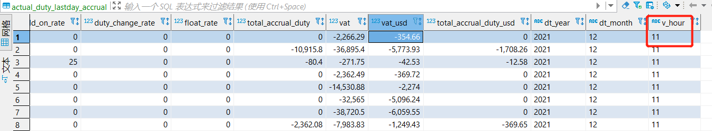

# PG Version Control 

## 1. 方案

同步至PG时增加一个字面量字段：当前时间的小时

小时字段类型字符串, **24小时制的小时**， 范围：00-23

```python
# opsdw/common/com_config.py

current_datetiem = datetime.now()
current_YmdH = current_datetiem.strftime("%Y-%m-%d-%H")

current_Hour = current_datetiem.strftime("%H")
```

## 2. 调用过程

根据需求，在对应的查询字符串的最后一列增加新字段v_hour来引用小时信息， 例如：

> '{current_Hour}' as v_hour

```python
# opsdw/pg/pg_config.py

# 1. query string for target table
actual_duty_lastday_accrual_query = f"""
    select *,
            '{current_Hour}' as v_hour  -- add here
            FROM {pg_dw_db}.dws_actual_duty_lastday_accrual 
···where dt='{today_Ymd}' 
"""
```


## 3. 示例

Table: **actual_duty_lastday_accrual**



