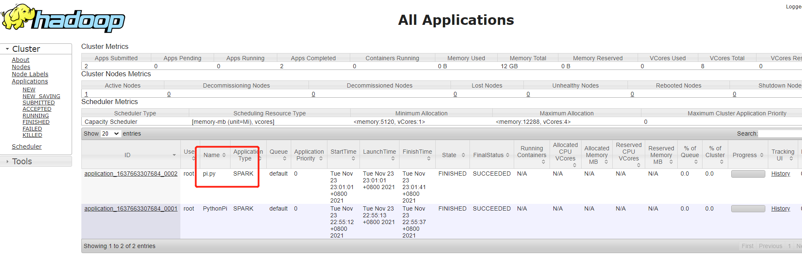

# Spark

## 1. PySpark

[Installation — PySpark 3.2.0 documentation (apache.org)](https://spark.apache.org/docs/latest/api/python/getting_started/install.html#python-version-supported)

### 1.1 Install Python3 on CentOS

```sh
# 安装编译工具
sudo yum install yum-utils
sudo yum-builddep python
yum install zlib-devel bzip2-devel openssl-devel ncurses-devel sqlite-devel readline-devel tk-devel gcc make
# 下载Python
cd /opt/Software
curl -O https://www.python.org/ftp/python/3.10.0/Python-3.10.0.tgz
# 解压
tar -zxvf Python-3.10.0.tgz -C /opt/module
#编译安装
[root@spark-master Python-3.10.0] ./configure --prefix=/usr/local/python3 --enable-optimizaions --with-ssl
[root@spark-master Python-3.10.0] make && make install
# 创建软链接
[root@spark-master Python-3.10.0]# ln -s /usr/local/python3/bin/python3 /usr/local/bin/python3
[root@spark-master Python-3.10.0]# ln -s /usr/local/python3/bin/pip3 /usr/local/bin/pip3


# 镜像 Linux下，修改 ~/.pip/pip.conf (没有就创建一个文件夹及文件。文件夹要加“.”，表示是隐藏文件夹)
#windows下，直接在 %userprofile% 目录中创建一个 pip目录，再新建文件 pip.ini
[global]
index-url=http://mirrors.aliyun.com/pypi/simple
[install]
trusted-host=mirrors.aliyun.com

```


## 2. 启动Spark

```sh
# master
[root@spark-master sbin]# start-master.sh
starting org.apache.spark.deploy.master.Master, logging to /opt/module/spark32/logs/spark-root-org.apache.spark.deploy.master.Master-1-spark-master.out
[root@spark-master sbin]

# worker

[root@spark-master sbin]# start-worker.sh spark://spark-master:7077
starting org.apache.spark.deploy.worker.Worker, logging to /opt/module/spark32/logs/spark-root-org.apache.spark.deploy.worker.Worker-1-spark-master.out
[root@spark-master sbin]#

```

## 3. Standalone 集群模式

```sh
[root@spark-master spark32]# cd bin
[root@spark-master bin]# spark-submit --master=spark://spark-master:7077 $SPARK_HOME/examples/src/main/python/pi.py
Pi is roughly 3.142880
[root@spark-master bin]#

```


## 4 Yarn集群

### 4.1 Client Mode

```sh

[root@spark-master bin]# spark-submit --master yarn --deploy-mode client $SPARK_HOME/examples/src/main/python/pi.py
Pi is roughly 3.149040
[root@spark-master bin]#
```


### 4.2 Cluster Mode

配置环境变量

```sh
vim /opt/module/spark32/conf/spark-env.sh

HADOOP_CONF_DIR=$HADOOP_HOME/etc/hadoop
YARN_CONF_DIR=$HADOOP_HOME/etc/hadoop

PYSPARK_PYTHON=/usr/local/bin/python3
SPARK_MASTER_IP=spark-master
SPARK_LOCAL_DIRS=/opt/module/spark32
```

提交

```sh

[root@spark-master bin]# spark-submit --master yarn --deploy-mode cluster $SPARK_HOME/examples/src/main/python/pi.py
[root@spark-master bin]#


```




## 5. 本地模式

```sh
[root@spark-master bin]# spark-submit --master local[*] $SPARK_HOME/examples/src/main/python/pi.py
Pi is roughly 3.144640
[root@spark-master bin]#
```


## 6. HIVE 与Spark 集成

### 6.1 配置

```sh
# hive-site.xml
cp hive-site.xml /opt/module/spark32/conf

# postgresql driver
[root@spark-master lib]# cp postgresql-42.2.5.jar /opt/module/spark32/jars
```

### 6.2 Issues

a. spark Compression codec com.hadoop.compression.lzo.LzoCodec not found.

b. 将lzo的jar包放到spark的jars中


##  7 Web UI 汇总

| Web UI                  | 默认端口                               | Mapping Port | 备注                                                         |      |
| ----------------------- | -------------------------------------- | ------------ | ------------------------------------------------------------ | ---- |
| Spark Application       | [4040](http://localhost:4040/)         | 14040        | 由 SparkContext 启动，显示以本地或 Standalone 模式运行的 Spark 应用，运行完成后，4040端口被注销了 |      |
| Spark Standalone Master | [8080](http://localhost:8080/)         | 18080        | 显示集群状态，以及以 Standalone 模式提交的 Spark 应用        |      |
| **HDFS NameNode**       | [9870](http://localhost:9870/)         | 19870        | 可浏览 HDFS 文件系统                                         |      |
| **YARN ResourceManager  | [8088](http://localhost:8088/)         | 18088        | 显示提交到 YARN 上的 Spark 应用                              |      |
| YARN NodeManager        | [8042](http://localhost:8042/)         | 18042        | 显示工作节点配置信息和运行时日志                             |      |
| MapReduce Job History   | [19888](http://localhost:19888/)       | 19888        | MapReduce 历史任务                                           |      |
| HiveServer2 服务        | 10000                                  | 10010        |                                                              |      |
| Metastore 服务          | 9083                                   | 19083        |                                                              |      |
| Azkaban Web UI          | [8081](http://10.226.98.58:8081/index) | 18081        |                                                              |      |
| SSH                     | 22                                     | 10086        |                                                              |      |
| MasterServer            | 5678                                   | 15678        | 非通信端口，只需本机端口不冲突即可.MasterServer 和 WorkerServer 不需要开启网络间通信，只需本机端口不冲突即可 |      |
| WorkerServer            | 1234                                   | 11234        | 非通信端口，只需本机端口不冲突即可                           |      |
| ApiApplicationServer    | 12345                                  | 12345        | 提供后端通信端口,管理员可根据实际环境中 DolphinScheduler 组件部署方案，在网络侧和主机侧开放相关端口 |      |
| zookeeper               | 8887                                   | 18887        |                                                              |      |
|                         | 18080                                  | 28080        | 默认历史服务器的端口，                                       |      |

## 8 Spark thriftserver

### 8.1 hive-site.xml配置文件

$SPARK_HOME/conf/hive-site.xml

```xml
<!--Thrift JDBC/ODBC server-->

   <property>

       <name>hive.server2.thrift.min.worker.threads</name>

       <value>5</value>

   </property>

   <property>

       <name>hive.server2.thrift.max.worker.threads</name>

       <value>200</value>

   </property>

   <property>

       <name>hive.server2.thrift.port</name>

       <value>12315</value>

   </property>

   <property>

       <name>hive.server2.thrift.bind.host</name>

       <value>spark-master</value>

   </property>

```

## 8.2 启动Spark thriftserver

```sh
$SPARK_HOME/sbin/start-thriftserver.sh --master spark://spark-master:7077

[root@spark-master sbin]#  sparkservices.sh start
Spark Thriftserver 服务已启动

[root@spark-master sbin]#  sparkservices.sh status
Thriftserver 服务运行正常
```

