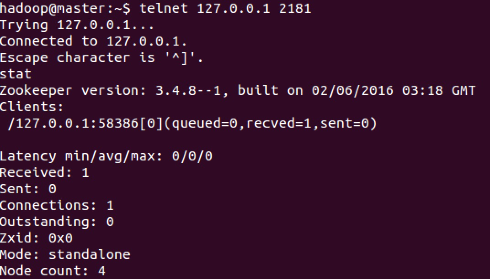
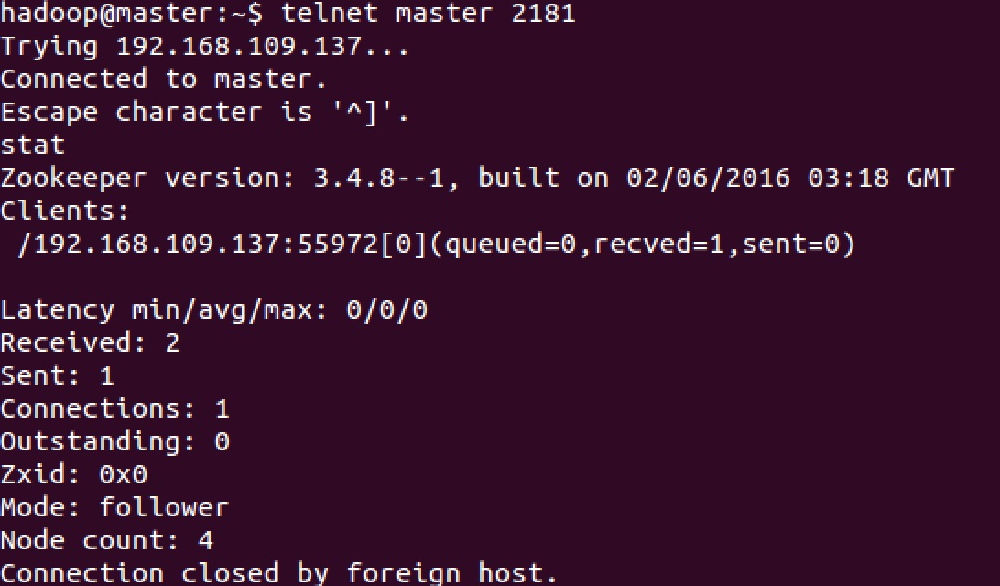
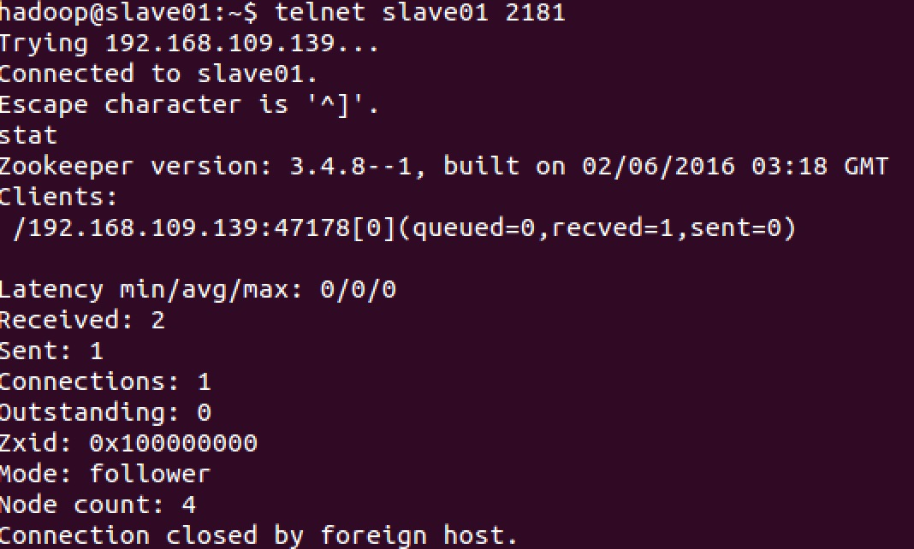
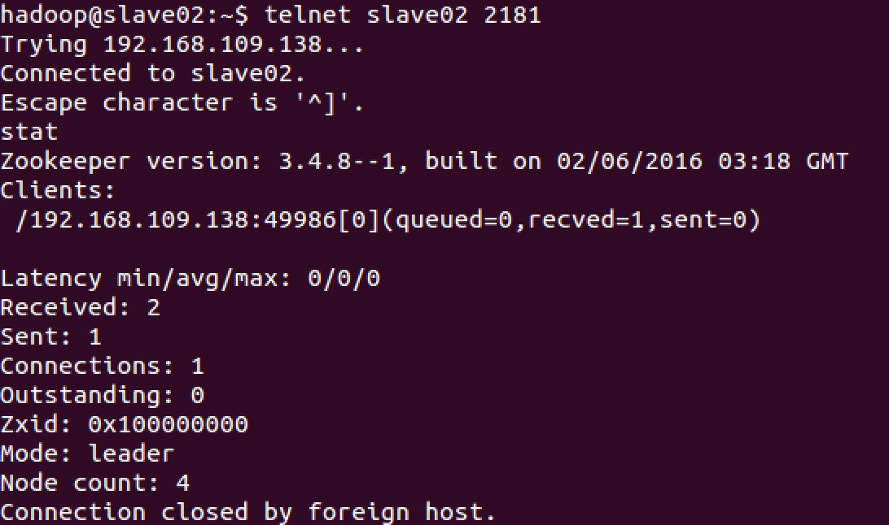

# ZooKeeper 

## 安装和配置

------

安装 ZooKeeper 之前需要先安装 JDK, 关于 JDK 的安装这里不再赘述。

1. 解压

   

   ```css
   sudo tar -zxvf zookeeper-3.4.8.tar.gz
   ```

2. 目录重命名

   

   ```css
   sudo mv zookeeper-3.4.8 zookeeper
   ```

3. 修改用户和用户组

   

   ```undefined
   sudo chown —R hadoop:hadoop zookeeper/
   ```

4. 环境变量配置

编辑 .bashrc 文件, 在文件末尾添加以下环境变量配置:


```bash
   # ZooKeeper Env
   export ZOOKEEPER_HOME=/opt/zookeeper
   export PATH=$PATH:$ZOOKEEPER_HOME/bin
```

运行以下命令使环境变量生效:


```bash
   source .bashrc
```

## 核心配置文件zoo.cfg

------

初次使用 ZooKeeper 时, 需要将 $ZOOKEEPER_HOME/conf 目录下的 zoo_sample.cfg 重命名为 zoo.cfg, zoo.cfg 默认配置如下:


```bash
# The number of milliseconds of each 
ticktickTime=2000
# The number of ticks that the initial 
# synchronization phase can take
initLimit=10
# The number of ticks that can pass between 
# sending a request and getting an acknowledgement
syncLimit=5
# the directory where the snapshot is stored.
# do not use /tmp for storage, /tmp here is just 
# example sakes.dataDir=/tmp/zookeeper
# the port at which the clients will connect
clientPort=2181
# the maximum number of client connections.
# increase this if you need to handle more clients
#maxClientCnxns=60
#
# Be sure to read the maintenance section of the 
# administrator guide before turning on autopurge.
#
# http://zookeeper.apache.org/doc/current/zookeeperAdmin.html#sc_maintenance
#
# The number of snapshots to retain in dataDir
#autopurge.snapRetainCount=3
# Purge task interval in hours
# Set to "0" to disable auto purge feature
#autopurge.purgeInterval=1
```

配置项说明如下:

- tickTime: ZooKeeper 中使用的基本时间单元, 以毫秒为单位, 默认值是 2000。它用来调节心跳和超时。例如, 默认的会话超时时间是两倍的 tickTime。
- initLimit: 默认值是 10, 即 tickTime 属性值的 10 倍。它用于配置允许 followers 连接并同步到 leader 的最大时间。如果 ZooKeeper 管理的数据量很大的话可以增加这个值。
- syncLimit: 默认值是 5, 即 tickTime 属性值的 5 倍。它用于配置leader 和 followers 间进行心跳检测的最大延迟时间。如果在设置的时间内 followers 无法与 leader 进行通信, 那么 followers 将会被丢弃。
- dataDir: ZooKeeper 用来存储内存数据库快照的目录, 并且除非指定其它目录, 否则数据库更新的事务日志也将会存储在该目录下。建议配置 dataLogDir 参数来指定 ZooKeeper 事务日志的存储目录。
- clientPort: 服务器监听客户端连接的端口, 也即客户端尝试连接的端口, 默认值是 2181。
- maxClientCnxns: 在 socket 级别限制单个客户端与单台服务器之前的并发连接数量, 可以通过 IP 地址来区分不同的客户端。它用来防止某种类型的 DoS 攻击, 包括文件描述符耗尽。默认值是 60。将其设置为 0 将完全移除并发连接数的限制。
- autopurge.snapRetainCount: 配置 ZooKeeper 在自动清理的时候需要保留的数据文件快照的数量和对应的事务日志文件, 默认值是 3。
- autopurge.purgeInterval: 和参数 autopurge.snapRetainCount 配套使用, 用于配置 ZooKeeper 自动清理文件的频率, 默认值是 1, 即默认开启自动清理功能, 设置为 0 则表示禁用自动清理功能。

更多 ZooKeeper 配置后面会写文章详细描述。

## 单机模式

------

1. zoo.cfg配置

   

   ```jsx
   ticketTime=2000
   clientPort=2181
   dataDir=/opt/zookeeper/data
   dataLogDir=/opt/zookeeper/logs
   ```

2. 启动 ZooKeeper 服务

可以使用如下命令来启动 ZooKeeper 服务


```css
   zkServer.sh start
```

服务启动信息如下:


1. 验证 ZooKeeper 服务

服务启动完成后, 可以使用 telnet 和 stat 命令验证服务器启动是否正常:




在单机模式中, Mode 的值是 "standalone"。

1. 停止 ZooKeeper 服务

想要停止 ZooKeeper 服务, 可以使用如下命令:


```css
   zkServer.sh stop
```

服务停止信息如下:


## 集群模式

------

1. zoo.cfg配置

在 master 机器上, 在单机模式的配置文件下增加了最后 5 行配置:


```jsx
   ticketTime=2000
   clientPort=2181
   dataDir=/opt/zookeeper/data
   dataLogDir=/opt/zookeeper/logs
   initLimit=10
   syncLimit=5
   server.1=master:2888:3888
   server.2=slave01:2888:3888
   server.3=slave02:2888:3888
```

相关配置说明:

- 集群模式中, 集群中的每台机器都需要感知其它机器, 在 zoo.cfg 配置文件中, 可以按照如下格式进行配置, 每一行代表一台服务器配置:

  

  ```undefined
   server.id=host:port:port
  ```

  id 被称为 Server ID, 用来标识服务器在集群中的序号。同时每台 ZooKeeper 服务器上, 都需要在数据目录(即 dataDir 指定的目录) 下创建一个 myid 文件, 该文件只有一行内容, 即对应于每台服务器的Server ID。

- ZooKeeper 集群中, 每台服务器上的 zoo.cfg 配置文件内容一致。

- server.1 的 myid 文件内容就是 "1"。每个服务器的 myid 内容都不同, 且需要保证和自己的 zoo.cfg 配置文件中 "server.id=host:port:port" 的 id 值一致。

- id 的范围是 1 ~ 255。

1. 创建myid文件

在 dataDir 指定的目录下 (即 /opt/zookeeper/data 目录) 创建名为 myid 的文件, 文件内容和 zoo.cfg 中当前机器的 id 一致。根据上述配置, master 的 myid 文件内容为 1。

1. slave配置

按照相同步骤, 为 slave01 和 slave02 配置 zoo.cfg 和 myid 文件。zoo.cfg文件内容相同, slave01 的 myid 文件内容为 2, slave02 的 myid 文件内容为 3。

1. 集群启动

在集群中的每台机器上执行以下启动命令:


```css
   zkServer.sh start
```

启动信息如下:







master 和 slave01 两台服务器的 Mode 值均为 follower, 表明它们在集群中的角色为 Follower。




slave02 服务器的 Mode 值为 leader, 表明它在集群中的角色为 Leader。

## 参考资料

[http://zookeeper.apache.org/doc/current/zookeeperStarted.html](https://link.jianshu.com?t=http://zookeeper.apache.org/doc/current/zookeeperStarted.html)